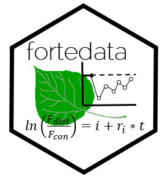

# fortedata: An open-data package for the R programming Language

Authors: Jeff W. Atkins, Ben Bond-Lamberty, Kalyn Dorheim, Stephanie Pennington, and Alexey Shiklomanov

The *fortedata* package provides functions for accessing and interpreting data associated with FoRTE: Forest Resilience Threshold Experiment located at the University of Michigan Biological Station. 
