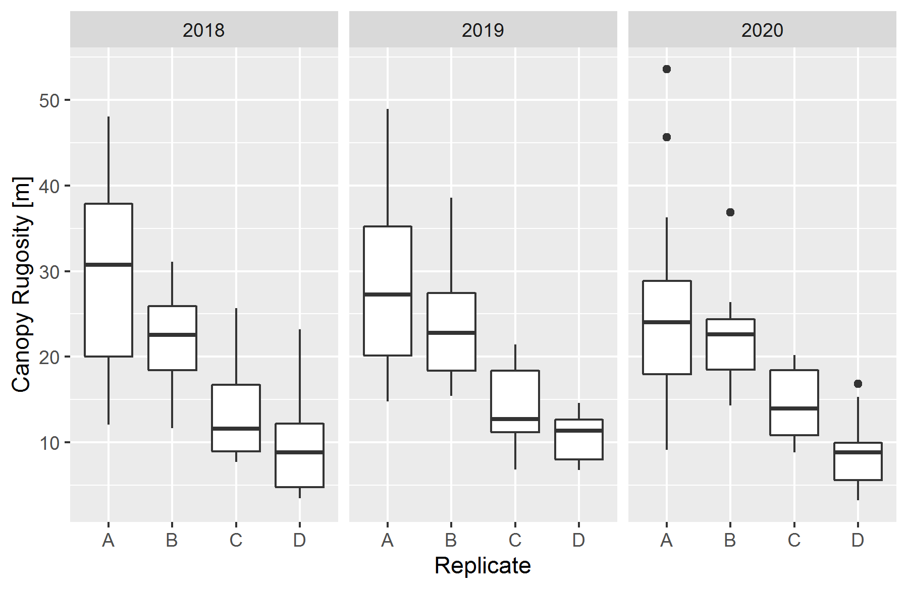

```{r setup, include = FALSE}
knitr::opts_chunk$set(
  collapse = TRUE,
  require(fortedata),
  require(ggplot2)
)

```

## Remote Sensing 

During FoRTE, multiple types of remote sensing data are being collected with the goal of creating a record of forest structural and spectral change. These data are collected coincidently with other data as outline below (see Remote Sensing Methods) 

## Remote Sensing Functions

The `fd_remote_sensing()` script within `fortedata` currently includes the following functions:

* `fd_hemi_camera()` returns a single dataset that includes derived estimates of leaf area index, gap fraction, clumping index, and NDVI (normalized difference vegetation index) from terrestrial, upward-facing hemispherical photos looking into the forest canopy taken 1 meter above-ground (Table S9 in ESSD manuscript, Atkins et al. 2020). The data package includes 1028 observations of each variable from 2018 and 2019.

* `fd_canopy_structure()` returns a single dataset that includes 28 structural metrics estimating canopy structural traits such as height, area/density, openness, complexity, and arrangement. Data were processed using  `forestr` version 1.0.1 (Atkins et al. 2018) in R Version 3.6.2.


* `fd_ceptometer()` returns a single dataset that includes estimates of the fraction of photosynthetically available radiation (faPAR) absorbed by the canopy as well as leaf area index (LAI_cept)--each derived from a handheld ceptometer (LP-80; Decagon Devices) (Table S11). The package includes 32 observations of each variable from 2019 and 16 from 2018 (Fig. 4). 
r

## Data Availability

```{r data-availble, fig.width = 6, fig.asp = .62, messages = FALSE, echo = FALSE}
no_of_records.df <- fd_observations()

no_of_records <- subset(no_of_records.df, table == 'fd_canopy_structure' | table == 'fd_hemi_camera')
# Heatmap
#x11(width = 10, height = 8)
ggplot2::ggplot(no_of_records, ggplot2::aes(x = as.factor(month), y = as.integer(year), fill= no_of_obs)) +
  ggplot2::geom_tile(ggplot2::aes(fill = no_of_obs), color = "black") +
  ggplot2::geom_text(ggplot2::aes(label = no_of_obs), color = "white") +
  ggplot2::coord_equal()+
  ggplot2::scale_fill_gradient(low = "#450d54", high = "#450d54", na.value = 'white')+
  #scale_fill_viridis(na.value = 'white')+
  ggplot2::scale_y_reverse()+
  ggplot2::theme_minimal()+
  ggplot2::theme(legend.position = "none")+
  ggplot2::ylab("Year")+
  ggplot2::xlab("Month")+
  ggplot2::ggtitle(paste("No. of observations currently available \nin each remote sensing function as of:", Sys.Date()))+
  ggplot2::facet_grid(table ~ .,  space = "free")+
  ggplot2::theme(strip.text.y = element_text(size = 9), strip.background = element_rect(
    color="black", fill="white", size= 0.5, linetype="solid"))


```

## Remote Sensing Methods

### Terrestrial lidar

Annual measurements of forest structure were taken using both 2- and 3-D terrestrial lidar during peak growing season (July-early August). 2-D lidar data are gathered using a Riegl 3100 VHSFLP portable canopy lidar unit (See Parker et al. 2004 and Hardiman et al. 2011 for a full description) and 3-D lidar data are collected using a Leica BLK360. Currently, 3-D lidar data are not included in `fortedata` due to processing delays resulting from Covid-19. 
### Canopy Structural Traits (CSTs)


We derived canopy structural trait metrics (Fahey et al. 2019) from 2-D terrestrial lidar data collected with a user-mounted, portable canopy lidar (PCL) system equipped with an upward facing, Riegl 3100VHS near‐infrared pulsed‐laser operating at 2000 Hz (Riegl LD90 3100 VHS; Riegl USA Inc., Orlando, Florida, USA). The PCL generates continuous LiDAR returns from a “slice” of the canopy as it is walked along a measured transect. For this study, we used 40 m transects at cardinal directions--north-to-south,  east-to-west--through subplot center for a total of 80 m of transect length per subplot. This mirrors the approach of Atkins et al. (2018) and Haridman et al. (2013) and is sufficient to account for spatial variability of forest structure (Hardiman et al. 2019).  A more detailed description of the development and implementation of this terrestrial laser scanning system is available in Parker et al. (2004) and Hardiman et al. ( 2011).  We derived canopy structural metrics using the forestr package (Atkins et al. 2018a, b) in R 3.5 (R Core Team, 2018). forestr produces a suite of canopy structural traits metrics that describe canopy area/density, openness, height, complexity, and arrangement (Atkins et al. (2018a). 


```{r fd_canopy_structure}
fd_canopy_structure_summary()
```

```{r rug, fig.width = 6, fig.asp = .65, messages = FALSE, echo = FALSE}
x <- fd_canopy_structure()

rugosity_boxplot <- ggplot(x, aes(y = rugosity, x = replicate))+
  geom_boxplot()+
  xlab("Replicate")+
  ylab("Canopy Rugosity [m]")+
  facet_grid(.~year)

#print(rugosity_boxplot)

#png("rugosity_boxplot.png")
ggsave(filename = "rugosity_boxplot.png", plot = rugosity_boxplot, device = "png")
print(rugosity_boxplot)
```
{width=50%}

### Hemispherical Camera Imagery

Below-canopy, hemispherical images  were taken using a 24 Megapixel DSLR camera (Regent Instruments; Quebec, QU, Canda) with a 180° hemispherical lens during peak leaf-out (~July). The camera was facing-upwards, into the canopy and was mounted on a self-leveling tripod with the lens at 1 m from the ground. Leaf area index (LAI~CAM~) was estimated using WinSCANOPY (Regent Instruments).
  
  {width=50%} 
  
  
  {width=40%}
  
  


```{r fd_hemi_camera}
fd_hemi_camera()
```

```{r cam, fig.width = 6, fig.asp = .65, messages = FALSE, echo = FALSE}
x <- fd_hemi_camera()

ggplot(x, aes(y = lai_cam, x = replicate))+
  geom_boxplot()+
  xlab("Replicate")+
  ylab("Leaf Area Index")

```

### Light Interception and Availbility

Light data--as *fpar*, the fraction of photosynthetically available radiation absorbed by the canopy--was acquired using a Decagon LP-80 handheld ceptometer (Decagon Devices; Pullman, Washington). *fpar* is the ratio of PAR above the canopy, to that measured below. *fpar* is assumed to be the difference between the two values. Below-canopy PAR measurements for each plot were taken along north-south and east-west transects (similar to PCL data above), with measurements taken every 1 to 3 m for a total of 30 - 60 measurements then averaged to make a subplot level mean of below-canopy PAR. Above-canopy PAR measurements were taken in open areas to ensure no interference from the canopy. 

```{r fd_ceptometer}
fd_ceptometer()
```


## References
[Atkins, J. W., Bohrer, G., Fahey, R. T., Hardiman, B. S., Morin, T. H., Stovall, A. E., ... & Gough, C. M. (2018). Quantifying vegetation and canopy structural complexity from terrestrial LiDAR data using the forestr r package. Methods in Ecology and Evolution, 9(10), 2057-2066.](https://besjournals.onlinelibrary.wiley.com/doi/pdf/10.1111/2041-210X.13061)

[Atkins, J. W., Agee, E., Barry, A., Dahlin, K. M., Dorheim, K., Grigri, M. S., ... & McGuigan, C. (2020). The fortedata R package: open-science datasets from a manipulative experiment testing forest resilience. Earth System Science Data Discussions, 1-18.](https://essd.copernicus.org/preprints/essd-2020-112/essd-2020-112.pdf)

[Hardiman, B. S., Bohrer, G., Gough, C. M., Vogel, C. S., & Curtis, P. S. (2011). The role of canopy structural complexity in wood net primary production of a maturing northern deciduous forest. Ecology, 92(9), 1818-1827.](https://esajournals.onlinelibrary.wiley.com/doi/pdf/10.1890/10-2192.1?casa_token=MQZpgQKa6ewAAAAA:DSJJvB1zmKSdyDGGjQzVdvBfobmyYlp1uOl2oa9fn8mvetH1-z2fgqdnyD5EJxPjRPqUHOx4Jn1c-Q)

[Parker, G. G., Harding, D. J., & Berger, M. L. (2004). A portable LIDAR system for rapid determination of forest canopy structure. Journal of Applied Ecology, 41(4), 755-767.](https://besjournals.onlinelibrary.wiley.com/doi/pdf/10.1111/j.0021-8901.2004.00925.x)
